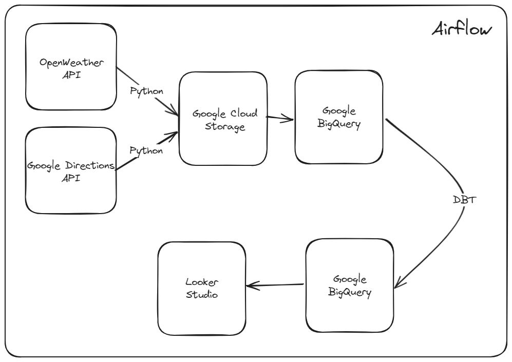
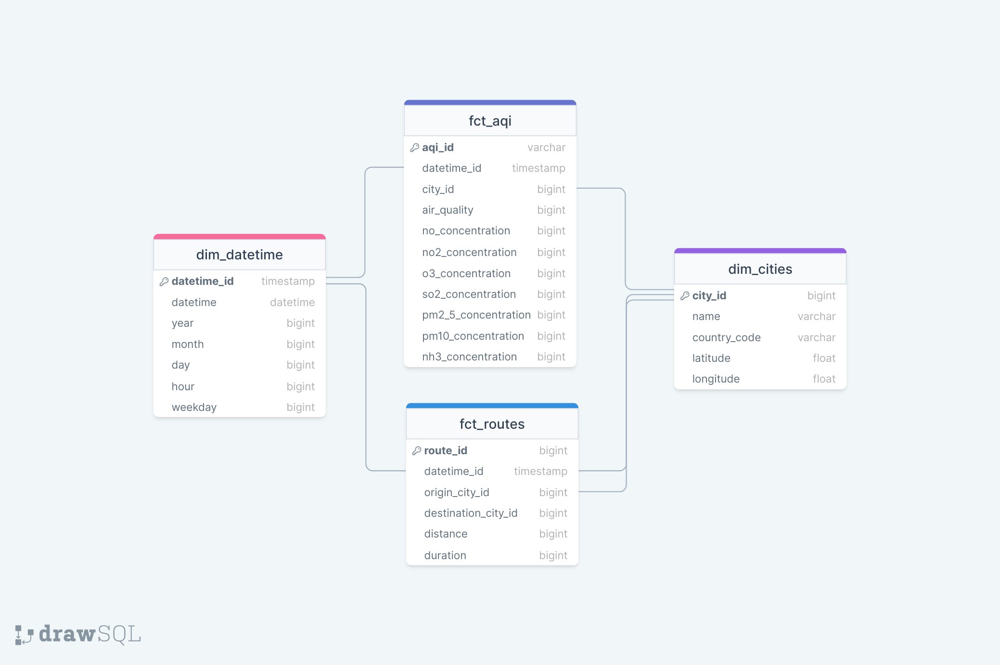
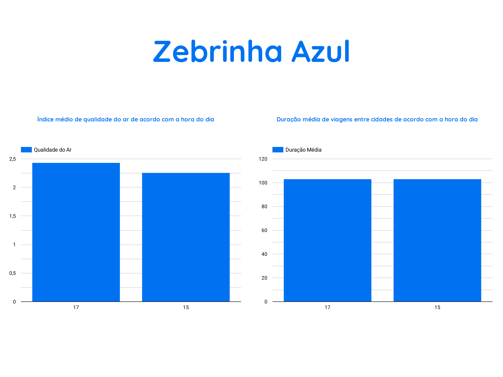

# bluezebra

Welcome to the Blue Zebra Data Analysis repository! This repository showcases the data analysis workflow of Blue Zebra, a fictional startup based in the Vale do Paraíba region in Brazil. Blue Zebra specializes in analyzing weather and traffic data to provide valuable insights.

## Overview

Blue Zebra utilizes [Apache Airflow](https://airflow.apache.org/docs/apache-airflow/stable/index.html), a powerful open-source platform, to automate and orchestrate the data processing tasks. The [Astro CLI](https://docs.astronomer.io/astro/cli/overview#:~:text=The%20Astro%20CLI%20is%20the,used%20with%20all%20Astronomer%20products.) is employed to streamline the instantiation of the Apache Airflow container, ensuring a quick and easy setup. In addition to Airflow, Blue Zebra leverages [dbt](https://docs.getdbt.com/docs/introduction) for transforming and modeling the data. dbt enables analysts and data engineers to transform their data in their warehouse more effectively, providing a SQL-based interface for analysts to define transformations and data models.

## Apache Airflow DAGs

Two Airflow Directed Acyclic Graphs (DAGs) run simultaneously:

1. **[Dataset Extraction DAG](dags/dataset_extraction.py):**
   - Interacts with [weather](https://openweathermap.org/api) and [traffic](https://developers.google.com/maps/documentation/directions/overview) APIs to fetch data.
   - Executes hourly to keep the database populated with up-to-date air pollution and travel time information for cities in the Vale do Paraíba and Litoral Norte regions.
   - This dag uploads the csv files to a bucket on Google Cloud Storage. There, you need to create an external table on BigQuery that loads the data from csv files in the folder, as the data will be appended.

2. **[dbt DAG](dags/dbt.py):**
   - Utilizes the [Cosmos](https://www.astronomer.io/blog/introducing-cosmos-1-0/) library to transform and model the extracted data.
   - Runs on BigQuery with the raw data uploaded from the other DAG.
   - Runs hourly as well, but half an hour after the full hour to let the other DAG finish uploading, guaranteeing freshness on the data.

## Data Structure

Blue Zebra employs a galaxy architecture to model its database. A galaxy schema is a database schema design that resembles a star schema but includes multiple fact tables, each associated with its set of dimension tables. This structure allows for more complex and interconnected relationships between data entities, providing a comprehensive view of the data in a data warehouse. These are the tables:

- **Fact Tables:**
  1. [`fct_aqi`](include/dbt/models/transform/fct_aqi.sql)
  2. [`fct_routes`](include/dbt/models/transform/fct_routes.sql)

- **Dimension Tables:**
  1. [`dim_cities`](include/dbt/models/transform/dim_cities.sql)
  2. [`dim_datetime`](include/dbt/models/transform/dim_datetime.sql)

## Looker Studio Integration

The processed and modeled data is visualized in Looker Studio, providing a graphical representation of air pollution and travel time data. Looker Studio facilitates a comprehensive understanding of the insights derived from the data analysis performed by Blue Zebra. We have here an example with two simple graphs, showing the difference in air quality and estimated travel time during the day. As more data gets ingested, the insights would be better and more precise.